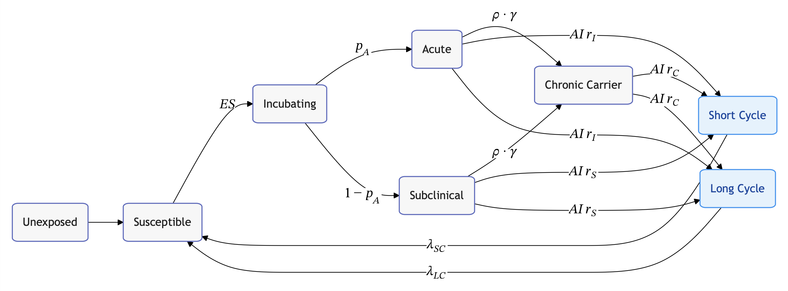

# epigraph — declarative flow diagrams for epi compartmental models



Turns an easy to read, declarative epi compartmental model specification into
[Mermaid document](https://mermaid.js.org/), which can be rendered by Mermaid
into a figure. The spec language is designed to be lightweight, simpler than
raw Mermaid, declarative, and epi-specific.

For example, here is as simple compartmental model spec (`typhoid.flow`)
loosely based on the [Gauld et al.
2018](https://journals.plos.org/plosntds/article?id=10.1371/journal.pntd.0006759)
Typhoid fever in Santiago, Chile model:

```
# Core compartments
state U  [label="Unexposed",         class=core]
state S  [label="Susceptible",       class=core]
state E  [label="Incubating",        class=core]
state A  [label="Acute",             class=core]
state SC [label="Subclinical",       class=core]
state C  [label="Chronic Carrier",   class=core]

# Environmental reservoirs
state SCycle [label="Short Cycle",   class=env]
state LCycle [label="Long Cycle",    class=env]

# Natural history
U  --> S
S  -- $$ES$$          --> E
E  -- $$p_A$$         --> A
E  -- $$1 - p_A$$     --> SC
A  -- $$\rho \cdot \gamma$$ --> C
SC -- $$\rho \cdot \gamma$$ --> C

# Environmental contamination (short / long cycle)
A  -- $$AI\,r_I$$     --> SCycle [class=envEdge]
SC -- $$AI\,r_S$$     --> SCycle [class=envEdge]
C  -- $$AI\,r_C$$     --> SCycle [class=envEdge]

A  -- $$AI\,r_I$$     --> LCycle [class=envEdge]
SC -- $$AI\,r_S$$     --> LCycle [class=envEdge]
C  -- $$AI\,r_C$$     --> LCycle [class=envEdge]

# Re-entry from reservoirs
SCycle -- $$\lambda_{SC}$$ --> S [class=envEdgeBold]
LCycle -- $$\lambda_{LC}$$ --> S [class=envEdgeBold]
```

To render this, 

```bash
$ epigraph typhoid.flow -o typhoid.mmd --pdf
```

## Requirements

Install Mermaid CLI with
[npm](https://docs.npmjs.com/downloading-and-installing-node-js-and-npm):

```bash
npm install -g @mermaid-js/mermaid-cli
```

## Styles

Optionally, a Mermaid stylesheet can be used with 

```bash
$ epigraph typhoid.flow --style typhoid.style -o typhoid.mmd --pdf
```

This JSON stylesheet looks like:

```json
{
  "global": {
    "theme": "forest",
    "direction": "LR",
    "math": "katex",
    "node.round": true
  },

  "classes": {
    "core": {
      "fill": "#f7f7f7",
      "color": "#222222",
      "stroke": "#5c6bc0",
      "stroke-width": 1.5,
      "rx": 8
    },

    "env": {
      "fill": "#e3f2fd",
      "color": "#0d47a1",
      "stroke": "#2196f3",
      "stroke-width": 1.5,
      "rx": 8
    },

    "coreEdge": {
      "stroke": "#5c6bc0",
      "width": 2
    },
    "envEdge": {
      "stroke": "#9e9e9e",
      "width": 2,
      "dash": "5,3"
    },
    "envEdgeBold": {
      "stroke": "#616161",
      "width": 3.5
    }
  }
}
```
